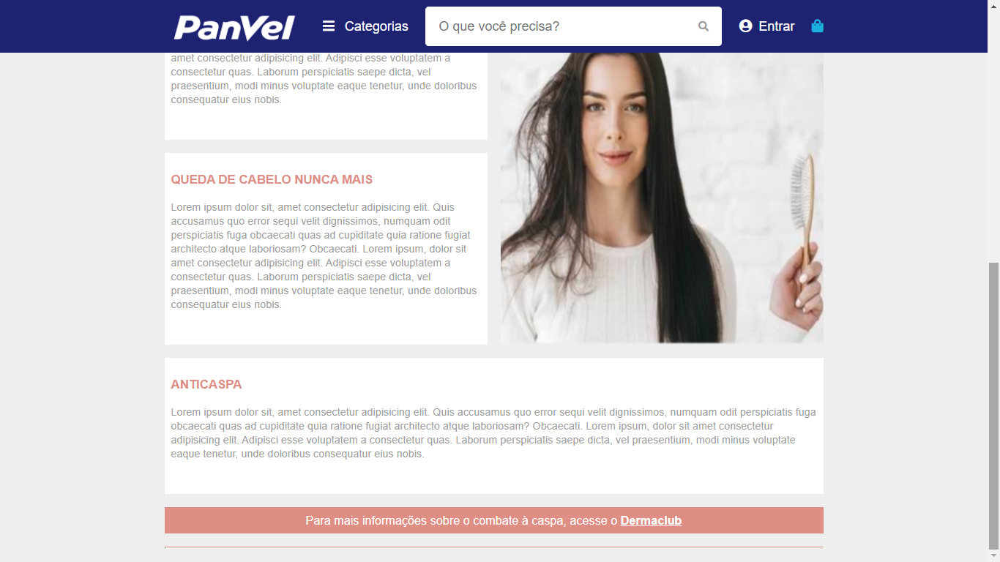

# Teste Meza

Projeto desenvolvido para a vaga de Front-End / UI Developer da Meza Digital.

O projeto é um clone de uma interface disponibilizada.

Para a criação do projeto utilizei ReactJS com styled-components

## Demonstração :art:

